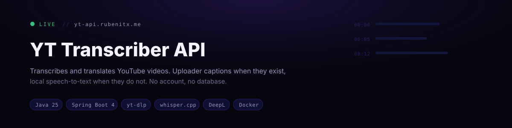
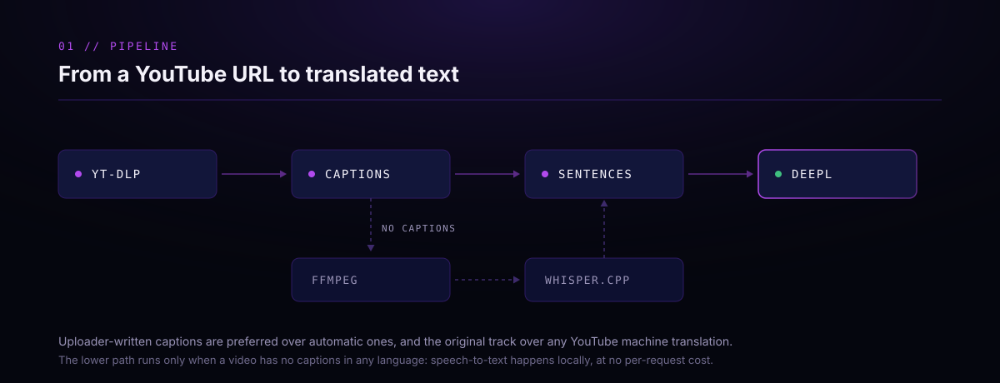
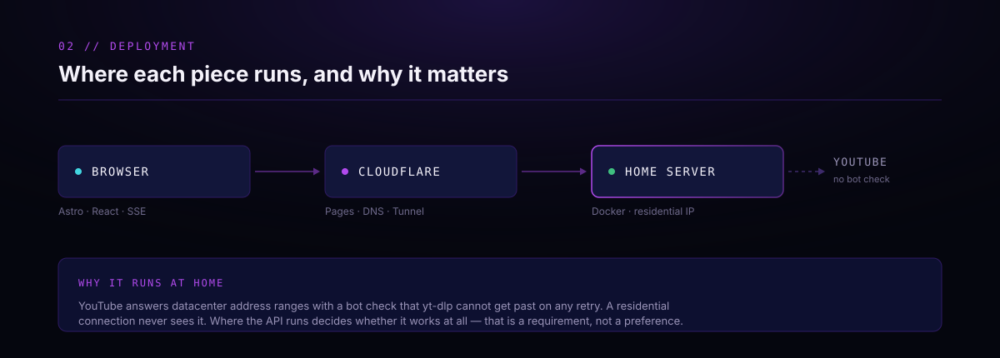

<div align="center">



[](https://github.com/rubenmtzb/yt-transcriber-api/actions/workflows/ci.yml)
[](https://openjdk.org/projects/jdk/25/)
[](https://spring.io/projects/spring-boot)
[](src/test/java)
[](LICENSE)

### **[▸ Try the app](https://yt.rubenitx.me)** · **[Frontend repository →](https://github.com/rubenmtzb/yt-transcriber-web)**

</div>

---

## What it does

Takes a YouTube URL, resolves its transcript, translates it, and returns it. Public and
login-free: no accounts, no history, no database. Every request is processed synchronously and
nothing outlives it.

External providers sit behind ports, so the source, transcription and translation adapters can
each be swapped without touching the domain or application layers.



## Features

- `POST /api/v1/transcriptions` — one blocking request/response, with request validation.
- `GET /api/v1/transcriptions/stream` — the same use case over Server-Sent Events, reporting real progress as it happens.
- Layered architecture (`api` → `application` → `domain`, with `integration` adapters behind ports).
- Source resolution via `yt-dlp` (invoked as a subprocess): video metadata plus captions in **any** language, preferring uploader-provided subtitles over auto-generated ones, and the original ASR track over YouTube's own machine translations of it.
- Local Speech-to-Text fallback via [whisper.cpp](https://github.com/ggml-org/whisper.cpp) for videos with no captions in any language — runs entirely on the machine, no external API and no per-request cost.
- Caption cues grouped into sentence-level units before translation, so the translator sees whole sentences instead of on-screen line wraps.
- Translation via the DeepL API, with its per-minute rate limit and its monthly quota mapped to distinct error codes.
- Two-bucket rate limiting — an anonymous per-session budget for honest UI feedback, and a per-client-address budget that is the ceiling that actually holds — plus a global concurrency guard.
- CORS locked to the configured frontend origin(s).
- Centralized error handling with a stable JSON error envelope and a per-request correlation id.
- Structured logging correlated by request id and session id.
- Actuator publishing `health` only by default; `metrics` and `prometheus` are available but off, because unauthenticated they hand out heap, GC and per-endpoint latencies to anyone who asks.

### Deliberately out of scope

- **Persistence of any kind.** Nothing is stored, so there is nothing to leak or to migrate.
- **Export formats.** The API returns a timed segment model; turning that into TXT, SRT, VTT or
  Markdown is the frontend's job and needs no round trip.

## API

### `POST /api/v1/transcriptions`

```bash
curl -X POST http://localhost:8080/api/v1/transcriptions \
  -H 'Content-Type: application/json' \
  -d '{"youtubeUrl": "https://www.youtube.com/watch?v=VIDEO_ID", "targetLanguage": "es"}'
```

```json
{
  "video": { "id": "VIDEO_ID", "title": "Example video", "durationSeconds": 213 },
  "sourceLanguage": "en",
  "targetLanguage": "es",
  "segments": [
    { "sequence": 0, "startMs": 0, "endMs": 4200, "sourceText": "Hello there.", "translatedText": "Hola." }
  ]
}
```

`targetLanguage` is an ISO 639-1 two-letter code. `sourceLanguage` is detected, not requested.

### `GET /api/v1/transcriptions/stream`

The same processing, streamed. It exists because the pipeline can take minutes on the Speech-to-Text path, and a browser waiting on a single blocking response has nothing to show meanwhile.

```bash
curl -N 'http://localhost:8080/api/v1/transcriptions/stream?youtubeUrl=https://www.youtube.com/watch?v=VIDEO_ID&targetLanguage=es'
```

It is a `GET` with query parameters rather than a `POST` with a body because the browser's native `EventSource` cannot issue POSTs. The parameters are validated against the exact same constraints as the POST body. Events emitted:

| Event     | Data                                                                                         |
|-----------|----------------------------------------------------------------------------------------------|
| `session` | The session id for this stream — `EventSource` cannot set request headers, so it cannot read the `X-Session-Id` response header either, and the id has to arrive as event data |
| `stage`   | `VALIDATING_URL`, `RESOLVING_VIDEO`, `TRANSCRIBING`, `TRANSLATING`, `PREPARING_RESULT` (raw, unquoted) |
| `result`  | The same JSON body as the POST endpoint                                                       |
| `error`   | The error envelope below                                                                     |

If the client closes the stream, the run is abandoned at the next stage boundary rather than carried to completion. Otherwise it would hold one of very few processing slots busy building a result nobody will read. An in-flight subprocess still finishes the stage it is on, since there is no cheap way to kill one mid-call.

### `GET /api/v1/transcriptions/usage`

What the caller has left of its hourly budget, so the UI can show the cost of a request before it
is spent rather than only reporting it once one has been refused.

```bash
curl 'http://localhost:8080/api/v1/transcriptions/usage'
```

```json
{
  "requestsRemaining": 3,
  "maxRequestsPerHour": 3,
  "requestsResetInSeconds": null,
  "audioMinutesRemaining": 60,
  "maxAudioMinutesPerHour": 60,
  "audioMinutesResetInSeconds": null,
  "maxVideoDurationSeconds": 1200
}
```

The budgets are rolling windows, not counters that empty on the hour: each recorded use frees
itself exactly an hour later. `...ResetInSeconds` is how long until the oldest use falls out of its
window, and is null when nothing is recorded. The reply reports whichever of the two buckets below
is closer to refusing. This endpoint never creates a session.

### Errors

Every failure returns the same envelope, on both endpoints:

```json
{ "code": "VIDEO_TOO_LONG", "message": "…", "retryable": false, "requestId": "…" }
```

| Code                         | HTTP | Retryable | Meaning                                            |
|------------------------------|------|-----------|----------------------------------------------------|
| `INVALID_REQUEST`            | 400  | no        | Malformed URL or target language                    |
| `NOT_FOUND`                  | 404  | no        | No such endpoint                                    |
| `UNSUPPORTED_SOURCE`         | 422  | no        | Private video, live stream, or too short to transcribe |
| `VIDEO_TOO_LONG`             | 413  | no        | Over `MAX_VIDEO_DURATION_SECONDS`                   |
| `RATE_LIMITED`               | 429  | yes       | Session budget spent, or the server is at capacity. Being turned away for capacity does not spend any of the caller's budget |
| `PROVIDER_UNAVAILABLE`       | 503  | yes       | An upstream provider or local binary failed         |
| `TRANSLATION_QUOTA_EXCEEDED` | 503  | no        | DeepL's monthly character quota is used up          |
| `INTERNAL_ERROR`             | 500  | no        | Unhandled failure                                   |

`requestId` echoes the `X-Request-Id` response header, so a report from the frontend can be traced straight to the matching log lines.

## Architecture



```text
Spring Boot API (this repo)
   api           -> HTTP boundary, request/response DTOs, validation
   application   -> use-case orchestration (TranscriptionService, SourceResolutionService,
                    TranslationService, SentenceGrouper)
   domain        -> ports and models (source, transcription, translation)
   integration   -> adapters implementing the domain ports (youtube, transcription, translation,
                    http, process)
   limiter       -> anonymous session identity, per-session budgets, global capacity guard
   exception     -> error envelope + centralized exception handling
   config        -> technical Spring configuration (properties, CORS, request-id filter, dotenv)
```

The domain layer has no dependency on Spring, HTTP clients, or any provider SDK. It is ports and records only. Each port has exactly one adapter today (`YtDlpSourceProvider`, `WhisperTranscriptionProvider`, `DeepLTranslationProvider`), and swapping any of them touches nothing above the `integration` package.

The two subprocess-backed adapters share `ExternalProcessRunner` (bounded timeout, stdout/stderr drained on separate threads so a full pipe buffer cannot deadlock the child) and `TempWorkspace` (a throwaway output directory tied to the run via try-with-resources).

Transcription is a fallback, not the main path: `SourceProvider` returns empty segments when a video has no usable captions in any language, and only then does `TranscriptionService` invoke `TranscriptionProvider`. With no Whisper model configured, that path fails cleanly with `PROVIDER_UNAVAILABLE` and everything else keeps working.

## Tech Stack

- Java 25 (LTS)
- Spring Boot 4.1.1 (Web MVC, Validation, Actuator)
- Micrometer + Prometheus
- Maven (via Maven Wrapper)
- JUnit 5, Mockito, AssertJ, MockMvc
- [`yt-dlp`](https://github.com/yt-dlp/yt-dlp) (external binary, invoked as a subprocess) for source resolution
- [whisper.cpp](https://github.com/ggml-org/whisper.cpp) (external binary) for local Speech-to-Text
- [DeepL API](https://www.deepl.com/en/docs-api) for translation

## Getting Started

```bash
./mvnw clean verify   # build + test
./mvnw spring-boot:run
```

The app starts on `http://localhost:8080`. Health check:

```bash
curl http://localhost:8080/actuator/health
```

### Docker

```bash
docker build -t yt-transcriber-api .
docker run -p 8080:8080 --env-file .env yt-transcriber-api
```

The image bundles `yt-dlp` (plus `deno`, which it needs for YouTube's bot-detection challenges), `ffmpeg`, `whisper-cli` and the `ggml-small.bin` model, so the Speech-to-Text path works out of the box — note that CPU-only inference in a container is meaningfully slower than a Mac's Metal-accelerated GPU.

## Configuration

Copy `.env.example` to `.env` and fill in the values you need locally.

| Variable                             | Default       | Description                                                  |
|--------------------------------------|---------------|--------------------------------------------------------------|
| `TRANSLATION_API_KEY`                | (empty)       | DeepL API key. Without it, translation fails with `PROVIDER_UNAVAILABLE` |
| `MAX_VIDEO_DURATION_SECONDS`         | 1200          | Longest video accepted (20 minutes)                          |
| `MAX_REQUESTS_PER_HOUR`              | 3             | Processings per session per hour. Shown in the UI, but not a boundary — a session id comes from the caller |
| `MAX_AUDIO_MINUTES_PER_HOUR`         | 60            | Audio-minutes budget per session per hour                    |
| `MAX_REQUESTS_PER_HOUR_PER_IP`       | 12            | Processings per client address per hour. **This is the limit that actually holds.** Looser than the per-session one because an address is shared by everyone behind one router |
| `MAX_AUDIO_MINUTES_PER_HOUR_PER_IP`  | 240           | Audio-minutes budget per client address per hour             |
| `MAX_CONCURRENT_TRANSCRIPTIONS`      | 2             | Global cap on transcriptions processed at once               |
| `CORS_ALLOWED_ORIGINS`               | `http://localhost:4321` | Comma-separated frontend origins allowed to call the API. **Leaving this empty makes every browser request fail with `Invalid CORS request` while curl keeps working** — the startup log says so at ERROR |
| `ACTUATOR_ENDPOINTS`                 | `health`      | Actuator endpoints to publish. Only `health` in production: `metrics` and `prometheus` are unauthenticated and hand out heap, GC, disk and per-endpoint latencies to anyone |
| `YTDLP_BINARY_PATH`                  | `yt-dlp`      | Path to the yt-dlp executable                                |
| `YTDLP_TIMEOUT_SECONDS`              | 120           | Timeout for each yt-dlp subprocess call. Generous on purpose: the resolve step is network-bound and a tight bound turns a slow response into an indistinguishable failure |
| `WHISPER_BINARY_PATH`                | `whisper-cli` | Path to the whisper.cpp CLI executable                       |
| `WHISPER_MODEL_PATH`                 | (empty)       | Path to a ggml model file. Empty disables local Speech-to-Text (videos with no captions in any language then fail with `PROVIDER_UNAVAILABLE` instead of transcribing) |
| `WHISPER_TIMEOUT_SECONDS`            | 900           | Timeout for audio extraction + whisper-cli combined          |
| `WHISPER_MIN_AUDIO_DURATION_SECONDS` | 15            | Videos shorter than this skip Speech-to-Text (language auto-detection is unreliable on very short clips) |

### Rate limiting

Two buckets are charged per request. The **per-session** one is what a person sees in the UI: the
session id is an anonymous identifier the browser sends back, so it maps neatly onto "what have I
used". It cannot bound anything, because the caller chooses it: a new id buys a new budget. The
**per-address** one is the real ceiling, resolved by `ClientIpFilter` from `CF-Connecting-IP` (set by
Cloudflare, which fronts the deployment, and overwritten there so a caller cannot forge it), falling
back to `X-Forwarded-For` and then the socket address. `GET /api/v1/transcriptions/usage` reports
whichever of the two is closer to refusing.

### Local requirements

`yt-dlp` must be installed and on `PATH` (`brew install yt-dlp` on macOS). It depends on `deno` to solve YouTube's bot-detection challenges, which Homebrew installs automatically. `ffmpeg` must also be on `PATH`, for yt-dlp's audio extraction on the Speech-to-Text path.

For the no-captions fallback, install [whisper.cpp](https://github.com/ggml-org/whisper.cpp)
(`brew install whisper-cpp`), download a multilingual ggml model from
[huggingface.co/ggerganov/whisper.cpp](https://huggingface.co/ggerganov/whisper.cpp/tree/main), and
point `WHISPER_MODEL_PATH` at it. It runs entirely on the machine: no external API, no per-request
cost.

Use `ggml-small.bin` (~490MB) as the floor. `base` (~140MB) hallucinates badly on sung or stylised
vocals, and a captionless music video is a normal case here rather than an edge one. `medium`
(~1.5GB) is measurably better again if the RAM and latency budget allows. CPU-only inference, as in
Docker, is far slower than a Mac's Metal-accelerated GPU, so raise `WHISPER_TIMEOUT_SECONDS`
accordingly. Leaving `WHISPER_MODEL_PATH` empty is fine; only that fallback stops working.

## Project Structure

```text
src/main/java/io/github/rubenix/yttranscriber/
  api/                  TranscriptionController, SSE stream channel + DTOs
  application/          Use-case services, SentenceGrouper, progress reporting
  domain/
    source/             VideoMetadata, SourceProvider port
    transcription/      TranscriptSegment, TranscriptionProvider port
    translation/        TranslatedSegment, TranslationProvider port
  integration/
    http/               Shared RestClient.Builder factory (timeouts, prototype-scoped)
    process/            ExternalProcessRunner + TempWorkspace, shared by subprocess adapters
    youtube/            YtDlpSourceProvider
    transcription/      WhisperTranscriptionProvider
    translation/        DeepLTranslationProvider
  limiter/              SessionIdFilter, UsageLimiter, CapacityGuard
  exception/            Error codes, error envelope, global handler
  config/               Properties, CORS, request-id filter, .env loader
```

## Two repositories, one app

This is the **backend**. It is the only side that holds provider API keys, and the only side that
talks to YouTube or DeepL.

| | Repository | Runs on |
|---|---|---|
| **API** | this one | Docker, home server |
| **Web** | [yt-transcriber-web](https://github.com/rubenmtzb/yt-transcriber-web) | Cloudflare Pages |

Two settings join them: the frontend's `PUBLIC_API_BASE_URL`, and `CORS_ALLOWED_ORIGINS` here
naming that frontend's origin. No shared code, no shared database.

## Deployment

Docker on a home server, published on loopback only and reached through a Cloudflare Tunnel at
<https://yt-api.rubenitx.me>. Two things follow from that, and both matter if you deploy this
yourself:

1. Moving the API to a cloud host reintroduces YouTube's bot check, and it stops resolving videos.
2. Cloudflare in front is what makes the per-address limit real. `ClientIpFilter` trusts
   `CF-Connecting-IP`, which holds only because Cloudflare rejects requests that arrive with that
   header already set. Exposed directly, it is forgeable and the limit stops bounding anything.

## License

[MIT](LICENSE)
